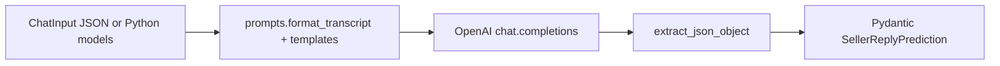

# Sales “brain” (`packages/brain`)

Guide for humans and Cursor agents working on the **LLM pipeline** that turns a short sales chat into a **suggested next seller message**. The **Python package** has no dependency on the Chrome extension, but the **MVP integration** calls a small local HTTP server from the extension’s service worker (see [Chrome extension + brain](#chrome-extension--brain-mvp)).

## What it does

1. **Input:** `ChatInput` — ordered `messages`, each `role` is `buyer` or `seller`, plus `text`.
2. **Prompt:** System + user messages built in `prompts.py` (marketplace tone, grounding rules, optional test “listing facts”).
3. **Model:** OpenAI Chat Completions with `response_format: json_object`.
4. **Output:** `SellerReplyPrediction` — `reply` (required), `rationale`, `confidence` — validated by Pydantic after parsing.

**Callers today:** the **Python API** (`predict_seller_reply`), the **CLI** (`fme-brain`), and an optional **local HTTP server** (`make brain-serve`) used by the extension. The server is a thin wrapper around `predict_seller_reply`; it does not add business logic.

## Layout (where to edit what)

| Path | Responsibility |
|------|----------------|
| `src/fme_brain/models.py` | `ChatTurn`, `ChatInput`, `SellerReplyPrediction` — **change the JSON contract here first**, then prompts and parsing. |
| `src/fme_brain/prompts.py` | System prompt, user transcript template, `format_transcript()`, listing constants (e.g. pickup address). **Primary place for prompt iteration.** |
| `src/fme_brain/predict.py` | `predict_seller_reply()` — OpenAI client, model id env default, wires prompt + parse + validate. |
| `src/fme_brain/parse.py` | `extract_json_object()` — strips optional ` ```json ` fences; extend if models return noisy wrappers. |
| `src/fme_brain/env.py` | `load_brain_dotenv()` — **repo root** `.env` then **`packages/brain/.env`** (override). Used by CLI and HTTP server. |
| `src/fme_brain/cli.py` | Typer CLI; calls `load_brain_dotenv()` before `predict_seller_reply`. |
| `src/fme_brain/server.py` | Local **FastAPI** app: `GET /health`, `POST /v1/predict` (body = `ChatInput` JSON). **OpenAI key only on the server process**, not in the extension. |
| `fixtures/*.json` | Example `ChatInput` JSON for manual runs and regression stories. |
| `tests/` | Unit tests (no live API by default). |

## Data flow



## Environment and secrets

- **`OPENAI_API_KEY`** — required for live calls.
- **`OPENAI_MODEL`** — optional; default is `gpt-4o` in `predict.py`.
- **`.env`:** Ignored by git. `load_brain_dotenv()` loads `$REPO_ROOT/.env` then `packages/brain/.env` (second wins on duplicate keys). Prefer `packages/brain/.env` for brain-only keys.
- **Never** put API keys in the extension bundle, committed JSON, or `db/` seeds. The extension talks to **localhost** only; the key stays in the Python process.
- **Optional (server bind):** `FME_BRAIN_HOST` (default `127.0.0.1`), `FME_BRAIN_PORT` (default `8765`) — read in `server.py`’s `main()` when you run `uvicorn` via `make brain-serve`. The extension default origin is `http://127.0.0.1:8765` (see `apps/extension/src/lib/brain-config.ts`).

## Commands

From repo root (after `make brain-install` or manual venv + `pip install -e ".[dev,server]"` in `packages/brain`):

- `make brain-predict` — runs the default fixture (`FILE=fixtures/...` relative to `packages/brain`). Sets `PYTHONPATH=src` so imports work regardless of editable-install quirks (see [Troubleshooting](#troubleshooting)).
- `make brain-serve` — starts the local HTTP API (`uvicorn fme_brain.server:app`) on **127.0.0.1:8765** by default.
- `cd packages/brain && PYTHONPATH=src .venv/bin/fme-brain fixtures/example_marketplace.json`
- `pytest` — from `packages/brain`; `pyproject.toml` sets `pythonpath = ["src"]` for the same reason as `make brain-predict`.

### Restarting the HTTP server after edits

The **`make brain-serve` process keeps Python modules in memory**. If you change anything the server imports—especially **`prompts.py`**, but also `predict.py`, `models.py`, `server.py`, etc.—**stop and start the server** so the next `POST /v1/predict` uses the new code. (There is no hot-reload hook today—always restart the process.)

- **Reloading the Chrome extension or Messenger does not restart Python.** Only the long-running `uvicorn` process matters for the extension MVP.
- **Human live-testing:** If a tester is checking prompt or listing-fact changes in the real thread, **restart `make brain-serve` after your edit** (and tell them to hard-reload the Messenger tab if they had a stale error state). Otherwise they will still see the previous system prompt, old constants, or old model defaults.
- **CLI vs server:** `fme-brain` and `make brain-predict` start a **fresh** process each time, so they always pick up file changes without a “server restart.”

## Extending the pipeline

### New fields on the model output

1. Add fields to `SellerReplyPrediction` in `models.py` (types, optional vs required).
2. Update the **Output format** section in `SYSTEM_SELLER_NEXT_MESSAGE` in `prompts.py` so the model knows the schema (and keep the word **JSON** in the prompt for `json_object` mode).
3. Add or adjust a fixture + a quick manual CLI run; extend tests if you add parsing edge cases.

### Richer input (listing id, item title, seller notes)

1. Extend `ChatInput` (or add a sibling model) in `models.py`.
2. Pass new data into the user message in `prompts.py` (`USER_TRANSCRIPT_TEMPLATE` or a new template).
3. Update `cli.py` to read the same JSON shape; keep **`POST /v1/predict`** in `server.py` aligned (same `ChatInput` body). Document in `packages/brain/README.md`.

### Swap or multi-provider models

Keep `predict_seller_reply` as the stable entry; isolate provider-specific code in `predict.py` or a new module (e.g. `providers/openai.py`). The extension and future API should depend on **the Python function contract**, not on OpenAI details.

### Stricter JSON / tool calling

If `json_object` is insufficient, consider OpenAI **structured outputs** / **JSON schema** responses and parse into the same Pydantic models.

## Testing philosophy

- **`tests/test_parse.py`** — parsing only; fast, no API.
- **Live smoke tests** — run the CLI with a fixture when changing prompts or model defaults; requires `OPENAI_API_KEY`.
- Avoid committing integration tests that call OpenAI in CI unless you use a mock or a dedicated secret.

## Chrome extension + brain (MVP)

End-to-end flow:

1. **Read:** `extractThreadSnapshot` in `apps/extension/src/lib/messenger-extract.ts` builds a list of row texts + sender labels from the Messenger DOM.
2. **Map:** `threadSnapshotToBrainMessages` (`thread-to-brain-messages.ts`) maps each row to `buyer` or `seller`. **English UI:** the logged-in user appears as **You** → treated as **seller**; all other senders → **buyer**. (Product rules for other locales belong in that module.)
3. **Predict:** The content script sends **`FME_BACKGROUND_BRAIN_PREDICT`** to the **service worker** with `{ messages }`. The worker **`fetch`es** `POST /v1/predict` on the local brain server (`brain-client.ts` + `brain-config.ts`). **No API key in the extension.**
4. **Write:** On success, the content script calls **`FME_BACKGROUND_SHOW_SUGGEST_REPLY`** with `reply` text, with **retries** (`ghost-suggest-retry.ts`) until `runSuggestReplyOnTab` succeeds — the composer often lives in a subframe that hydrates late.

On each full **Messenger tab load**, `apps/extension/src/content/messenger.ts` still schedules the assistant chip + brain-driven ghost suggestion (gate or remove before shipping to end users). See [apps/extension/README.md](../apps/extension/README.md).

## Troubleshooting

| Symptom | Likely cause |
|---------|----------------|
| `OpenAIError` / missing API key | `.env` not saved, wrong path, or a code path that skips `load_brain_dotenv()` (CLI and server load it). |
| `ModuleNotFoundError: fme_brain` | Editable install missing, or Python **ignoring `*.pth` files whose names start with `_`**. **Fix:** `make brain-predict` / `make brain-serve` (set `PYTHONPATH=src`), or `pytest` (uses `pythonpath` in `pyproject.toml`), or `PYTHONPATH=packages/brain/src` when invoking tools manually. |
| Extension `brainSuggest:predict failed` | Brain server not running, wrong host/port, or HTTP error from `/v1/predict`. Run `make brain-serve`, set `OPENAI_API_KEY`, check `http://127.0.0.1:8765/health`. |
| **Old behavior after editing `prompts.py`** (e.g. wrong address, previous tone) | The **`make brain-serve` process** was not restarted. **Stop and start** the server; reloading Chrome or the extension does not reload Python. |
| Validation error on model output | Prompt/schema drift; tighten prompt or relax `SellerReplyPrediction` / parsing. |
| Typer “unexpected argument” | The CLI is a **single** command: `fme-brain <path>` or `fme-brain -`, not `fme-brain predict …`. |

## Further reading

- Quick start: [packages/brain/README.md](../packages/brain/README.md)
- Repo map: [docs/monorepo.md](monorepo.md)
