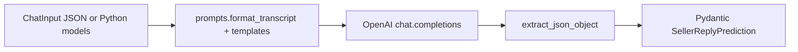

# Sales “brain” (`packages/brain`)

Guide for humans and Cursor agents working on the **LLM pipeline** that turns a short sales chat into a **suggested next seller message**. This package is **deliberately separate** from the Chrome extension: same repo, no shared imports today.

## What it does

1. **Input:** `ChatInput` — ordered `messages`, each `role` is `buyer` or `seller`, plus `text`.
2. **Prompt:** System + user messages built in `prompts.py` (marketplace tone, grounding rules, optional test “listing facts”).
3. **Model:** OpenAI Chat Completions with `response_format: json_object`.
4. **Output:** `SellerReplyPrediction` — `reply` (required), `rationale`, `confidence` — validated by Pydantic after parsing.

There is **no HTTP server** in this package; callers can use the Python API or the CLI.

## Layout (where to edit what)

| Path | Responsibility |
|------|----------------|
| `src/fme_brain/models.py` | `ChatTurn`, `ChatInput`, `SellerReplyPrediction` — **change the JSON contract here first**, then prompts and parsing. |
| `src/fme_brain/prompts.py` | System prompt, user transcript template, `format_transcript()`, test constants (e.g. mock pickup address). **Primary place for prompt iteration.** |
| `src/fme_brain/predict.py` | `predict_seller_reply()` — OpenAI client, model id env default, wires prompt + parse + validate. |
| `src/fme_brain/parse.py` | `extract_json_object()` — strips optional ` ```json ` fences; extend if models return noisy wrappers. |
| `src/fme_brain/cli.py` | Typer CLI; loads `.env` from **repo root** then **`packages/brain/.env`** (override). |
| `fixtures/*.json` | Example `ChatInput` JSON for manual runs and regression stories. |
| `tests/` | Unit tests (no live API by default). |

## Data flow



## Environment and secrets

- **`OPENAI_API_KEY`** — required for live calls.
- **`OPENAI_MODEL`** — optional; default is `gpt-4o` in `predict.py`.
- **`.env`:** Ignored by git. The CLI loads `$REPO_ROOT/.env` then `packages/brain/.env` (second wins on duplicate keys). Prefer `packages/brain/.env` for brain-only keys.
- **Never** put API keys in the extension, committed JSON, or `db/` seeds.

## Commands

From repo root (after `make brain-install` or manual venv + `pip install -e ".[dev]"` in `packages/brain`):

- `make brain-predict` — runs the default fixture (`FILE=fixtures/...` relative to `packages/brain`).
- `cd packages/brain && fme-brain fixtures/example_marketplace.json`
- `pytest` — from `packages/brain` with dev extras installed.

## Extending the pipeline

### New fields on the model output

1. Add fields to `SellerReplyPrediction` in `models.py` (types, optional vs required).
2. Update the **Output format** section in `SYSTEM_SELLER_NEXT_MESSAGE` in `prompts.py` so the model knows the schema (and keep the word **JSON** in the prompt for `json_object` mode).
3. Add or adjust a fixture + a quick manual CLI run; extend tests if you add parsing edge cases.

### Richer input (listing id, item title, seller notes)

1. Extend `ChatInput` (or add a sibling model) in `models.py`.
2. Pass new data into the user message in `prompts.py` (`USER_TRANSCRIPT_TEMPLATE` or a new template).
3. Update `cli.py` to read the same JSON shape; document in `packages/brain/README.md`.

### Swap or multi-provider models

Keep `predict_seller_reply` as the stable entry; isolate provider-specific code in `predict.py` or a new module (e.g. `providers/openai.py`). The extension and future API should depend on **the Python function contract**, not on OpenAI details.

### Stricter JSON / tool calling

If `json_object` is insufficient, consider OpenAI **structured outputs** / **JSON schema** responses and parse into the same Pydantic models.

## Testing philosophy

- **`tests/test_parse.py`** — parsing only; fast, no API.
- **Live smoke tests** — run the CLI with a fixture when changing prompts or model defaults; requires `OPENAI_API_KEY`.
- Avoid committing integration tests that call OpenAI in CI unless you use a mock or a dedicated secret.

## Relationship to the extension

- The extension extracts Messenger threads in `apps/extension/`; it does **not** import `fme_brain`.
- A future integration will likely: serialize turns to `ChatInput` JSON (or call a backend that does), then display `SellerReplyPrediction.reply`. Mapping **display names → buyer/seller** happens at the integration layer, not inside the brain.

## Troubleshooting

| Symptom | Likely cause |
|---------|----------------|
| `OpenAIError` / missing API key | `.env` not saved, wrong path, or CLI run from a context that skips `cli.py` dotenv loading. |
| `ModuleNotFoundError: fme_brain` | Editable install missing: `pip install -e ".[dev]"` inside `packages/brain` venv. |
| Validation error on model output | Prompt/schema drift; tighten prompt or relax `SellerReplyPrediction` / parsing. |
| Typer “unexpected argument” | The CLI is a **single** command: `fme-brain <path>` or `fme-brain -`, not `fme-brain predict …`. |

## Further reading

- Quick start: [packages/brain/README.md](../packages/brain/README.md)
- Repo map: [docs/monorepo.md](monorepo.md)
